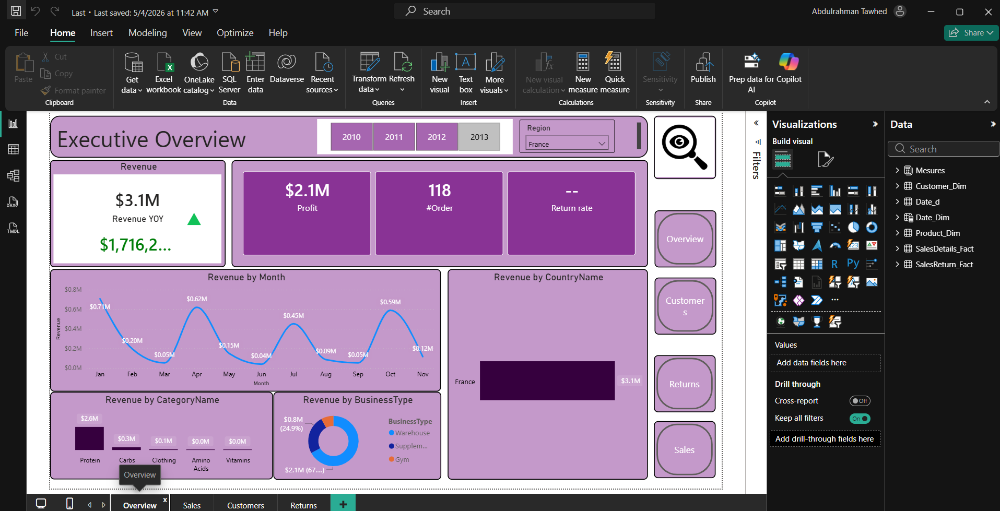

# PowerBI Executive Dashboard

An interactive, end-to-end Power BI business intelligence solution designed to track organizational revenue, profitability, and customer demographics for C-suite executive decision-making.

## 📊 Dashboard Preview

---

## 💡 Key Features & Metrics
* **Executive Overview Card Grid:** High-level tracking of core KPIs, including total Revenue ($3.1M), net Profit ($2.1M), overall Order volume (118 orders), and Year-over-Year (YoY) performance metrics.
* **Temporal Revenue Trends:** A dynamic *Revenue by Month* line chart pinpointing seasonal performance spikes and cyclical dips throughout the physical year.
* **Categorical Segmentation:** Granular breakdown of earnings across product lines (*Revenue by CategoryName*) and partner channels (*Revenue by BusinessType* via doughnut visualization).
* **Geographical Distribution:** A dedicated regional reporting lens (*Revenue by CountryName*) paired with cross-filtering region slicers for targeted market assessment.
* **Intuitive UI/UX Navigation:** Interactive side-dock buttons enabling seamless, application-like traversal across report views (*Overview, Customers, Returns, Sales*).

---

## 🛠️ Data Architecture & Tools Used
* **Power BI Desktop:** Core engine used for semantic modeling, dashboard layout orchestration, and canvas design.
* **Power Query (ETL):** Utilized for intensive data cleansing, normalizing date formatting, and splitting transactional data into clean dimension/fact structures.
* **DAX (Data Analysis Expressions):** Engineered to build robust business metrics, including dynamic YTD/YoY calculations and relational summary aggregations.
* **Star Schema Modeling:** Architecture organized into highly optimized Dimension Tables (`Customer_Dim`, `Product_Dim`, `Date_Dim`) and Fact Tables (`SalesDetails_Fact`, `SalesReturn_Fact`) to minimize cross-filtering latency.
